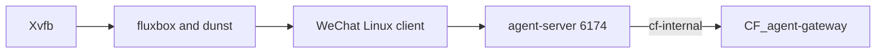
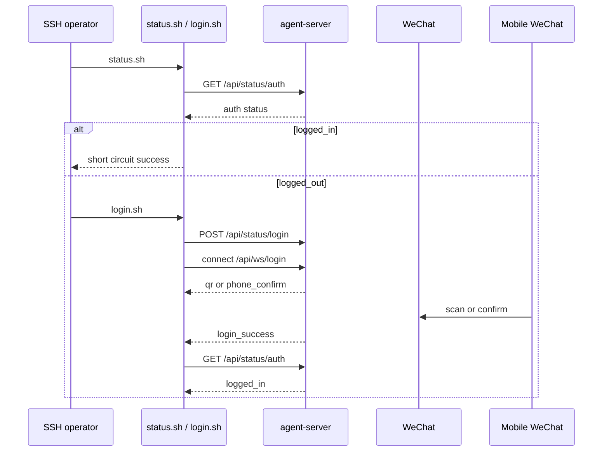

# 01 架构设计

## 当前生产架构

CFserver 使用容器内虚拟显示环境运行微信，无需宿主桌面会话。正式链路如下：

- Xvfb 使用 `DISPLAY=:99` 和 `1280x800x24`。
- Gateway 通过 `http://cf-agent-wechat:6174` 调用 agent-server。
- 生产设置为 `ENABLE_VNC=0`。

VNC、noVNC、x11vnc、websockify、宿主 X11 挂载、宿主 XFCE 和 RDP 均不在
当前生产链路中。它们只可能出现在明确标为“历史实验、已废弃、非当前生产方案”
的旧记录里。

## 组件职责

| 组件 | 职责 | 边界 |
| --- | --- | --- |
| Xvfb | 在容器内提供 `:99` 虚拟显示器 | 不依赖宿主 X11 |
| fluxbox | 管理容器内微信窗口 | 不由宿主 XFCE 管理 |
| dunst | 提供容器内通知组件 | 不提供远程桌面 |
| WeChat Linux 客户端 | 维持微信会话和客户端进程 | 手机操作仍可能是登录前置条件 |
| agent-server | 提供健康、登录、聊天和消息接口 | 不负责 AI 推理 |
| CF_agent-gateway | 通过 `cf-internal` 调用本服务 | 内部权限与编排不属于本项目 |

容器使用镜像默认启动流程，不使用自定义 entrypoint 覆盖。

## 部署边界

正式入口为 `docker/compose.cfserver.yaml`，正式容器为 `cf-agent-wechat`。该配置：

- 挂载生产数据到 `/data`，微信用户目录到 `/home/wechat`。
- 将 root-only Token 只读挂载到 `/data/auth-token`。
- 设置 `ENABLE_VNC=0`，配置 6174 健康检查。
- 接入外部网络 `cf-internal`，使用 `restart: unless-stopped`。

`docker/docker-compose.yml` 是实验室或验证配置，不得作为 CFserver 正式配置。
生命周期操作见 [CFserver 正式部署](deployment/cfserver-production.md)。

## 登录控制流

已实机验证的是已信任设备的 `phone_confirm` 流程。完全新设备的 SSH 二维码流程
已经实现但尚未实机验证。详细说明见 [微信登录管理](login-management.md)。

## 网络与调用关系

`cf-agent-wechat` 和 `CF_agent-gateway` 接入 `cf-internal`。截至 2026-08-13，
Gateway 已通过 `http://cf-agent-wechat:6174` 调用并验证：

- `/health`
- `/api/status/auth`
- `/api/chats`
- `/api/messages/{chat_id}`

这只证明本项目接口及网络访问可用，不证明 Gateway 内部权限、Hermes 或企业业务
逻辑已经完成。

## 数据与认证

生产持久化单元为 `/srv/storage/cf-agent-wechat/data`、`wechat-home` 和
`secrets/auth-token`。Token 目录为 `root:root 700`，Token 文件为
`root:root 600`。宿主登录脚本通过受控 sudo 读取默认路径，不应放宽权限。

## 健康与登录是不同状态

容器 `healthy` 不等于微信已登录。正确判断顺序为：

1. Compose 容器运行。
2. 容器健康。
3. `status.sh` 返回 `logged_in`。
4. 调用所需业务接口。

`logged_out` 需要执行登录流程；`app_not_running` 或 `unhealthy` 应先排查进程和
日志。步骤见 [故障排查](troubleshooting.md)。

## 项目边界

本项目提供微信入口、登录管理、消息接口和 Gateway 网络访问。Gateway 内部身份、
权限、Hermes 调用、Skills 与企业系统均是外部边界。
