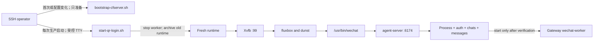

# 01 架构设计

## 当前生产架构

CFserver 使用容器内虚拟显示环境运行微信，无需宿主桌面会话。正式链路如下：



- Xvfb 使用 `DISPLAY=:99` 和 `1280x800x24`。
- Gateway 通过 `http://cf-agent-wechat:6174` 调用 agent-server。
- 生产设置为 `ENABLE_VNC=0`。
- 唯一生产启动入口为 `./scripts/start-qr-login.sh`，每次使用全新 runtime 和二维码。
- Bootstrap 只做基础准备，不创建/恢复微信 session，也不启动 Agent 或 Worker。
- 本仓库只能在脚本运行后停止并复核 worker；Gateway boot/restart stop gate 必须在
  CFserver 实机验证。

VNC、noVNC、x11vnc、websockify、宿主 X11 挂载、宿主 XFCE 和 RDP 均不在
当前生产链路中。它们只可能出现在明确标为“历史实验、已废弃、非当前生产方案”
的旧记录里。

## 组件职责

| 组件 | 职责 | 边界 |
| --- | --- | --- |
| Xvfb | 在容器内提供 `:99` 虚拟显示器 | 不依赖宿主 X11 |
| fluxbox | 管理容器内微信窗口 | 不由宿主 XFCE 管理 |
| dunst | 提供容器内通知组件 | 不提供远程桌面 |
| WeChat Linux 客户端 | 维持微信会话和客户端进程 | 手机操作仍可能是登录前置条件 |
| agent-server | 提供健康、登录、聊天和消息接口 | 不负责 AI 推理 |
| CF_agent-gateway | 通过 `cf-internal` 调用本服务 | 内部权限与编排不属于本项目 |

容器使用镜像默认启动流程，不使用自定义 entrypoint 覆盖。

## 部署边界

正式 Compose 为 `docker/compose.cfserver.yaml`，生命周期入口为
`start-qr-login.sh`/`stop-qr-runtime.sh`。正式容器为 `cf-agent-wechat`。该配置：

- 挂载
  `${CF_AGENT_WECHAT_RUNTIME_ROOT:-/srv/storage/cf-agent-wechat/runtime}/data` 到
  `/data`，同根 `wechat-home` 到 `/home/wechat`。
- 将 root-only Token 只读挂载到 `/data/auth-token`。
- 设置 `ENABLE_VNC=0`，配置 6174 健康检查。
- 接入外部网络 `cf-internal`，固定 alias `cf-agent-wechat`，6174 只绑定 loopback。
- 使用 `restart: "no"`；进程 crash、Docker daemon 和 Host 重启均不恢复旧会话。
- 当前上游镜像需要 `seccomp=unconfined` 与 `SYS_PTRACE`，两者必须持续安全审查。

`docker/docker-compose.yml` 是实验室或验证配置，不得作为 CFserver 正式配置。
生命周期操作见 [CFserver 正式部署](deployment/cfserver-production.md)。

## 登录控制流

```mermaid
sequenceDiagram
    participant O as SSH operator
    participant S as start-qr-login.sh
    participant G as Gateway worker
    participant R as runtime/archive
    participant A as agent-server
    participant W as WeChat
    participant P as Mobile WeChat
    O->>S: start fresh QR runtime
    S->>S: reject env overrides; attest Host/Compose/Gateway/permissions/tree
    S->>S: acquire 0640 lock
    S->>G: stop and verify worker service stopped
    S->>S: capacity/inode/inventory; Hash venv
    S->>R: archive current or legacy layout (schema v2)
    S->>R: create fresh data and wechat-home with approved UID/GID/mode
    S->>W: start; attest actual container; verify stable process
    S->>A: login with newAccount=true
    A-->>S: QR data
    S-->>O: render at least one QR in SSH
    P->>W: scan and confirm
    A-->>S: login_success
    loop bounded POST_LOGIN_READY_TIMEOUT
        S->>A: auth, chats, one messages read
    end
    S->>G: start only after all checks pass
    S->>G: contract checker verifies instance/health/heartbeat/Poll/auth
```

`logged_in` 不再短路 forced login。强制路径必须实际渲染 QR，登录后 API 使用有界
等待。2026-08-13 已信任设备的 `phone_confirm` 只属于历史基线；当前完整流程仍待
CFserver 实机验证。详细说明见 [微信登录管理](login-management.md)。

## 网络与调用关系

`cf-agent-wechat` 和 `CF_agent-gateway` 接入 `cf-internal`。截至 2026-08-13，
Gateway 已通过 `http://cf-agent-wechat:6174` 调用并验证：

- `/health`
- `/api/status/auth`
- `/api/chats`
- `/api/messages/{chat_id}`

这只证明本项目接口及网络访问可用，不证明 Gateway 内部权限、Hermes 或企业业务
逻辑已经完成。

## 数据与认证

当前运行单元为 `/srv/storage/cf-agent-wechat/runtime/data` 和
`runtime/wechat-home`；现有/legacy 与新 Runtime 都必须精确匹配批准非 root UID/GID
和 mode `700`，不继承漂移。每次启动在有界 no-follow 树扫描及 bytes/percent/inode、
inventory 门禁后，才把旧 Runtime 移入 `session-archive/<UTC时间戳>/`。首次上线只有
legacy 两目录时进入同一 Archive；mixed layout fail closed。

Archive payload 可能含完整 session、账号/聊天标识与消息数据，整体为 `restricted`；
Manifest schema v2 只描述 manifest 自身不含实际值，Archive 不挂回生产、不自动删除。
Token 是独立 `secrets/auth-token`，精确 `root:root 600`、单 hardlink、非 symlink，
不得进入 Runtime/Archive/argv/environment/inspect/Compose config/log/CI。start/stop/
retention 共用批准 owner/management GID、mode `0640` 的锁；dry-run 在加锁前返回。

## 健康与登录是不同状态

容器 `healthy` 或 auth `logged_in` 都不等于生产可用。正确判断顺序为：

1. Compose 容器运行。
2. agent-server 可访问。
3. `/usr/bin/wechat` 真实进程持续存在。
4. auth 返回 `logged_in`。
5. `/api/chats` 可读。
6. 启动放行前，chats 非空且对 API 返回的一个聊天读取 messages 成功。
7. Gateway `worker` service running/healthy，contract checker 无输出地确认当前实例、
   30 秒内 heartbeat、最新 Poll Cycle 成功和 auth=`logged_in`。

Compose healthcheck 只证明容器和 Agent API 健康，不能替代第 3 至第 7 项。

`status.sh` 只有进程、auth、chats 同时通过才返回生产可用。`logged_out`、进程不存在
或消息 API 不可读都必须回到 forced-QR 生命周期；步骤见 [故障排查](troubleshooting.md)。

## 项目边界

本项目提供微信入口、登录管理、消息接口和 Gateway 网络访问。Gateway 内部身份、
权限、Hermes 调用、Skills 与企业系统均是外部边界。本仓库只协调 Gateway `worker`
service（角色名 WeChat worker），不启停 `dispatch-worker` 或 `delivery-worker`，
不修改 Gateway、PostgreSQL、Checkpoint 或其他仓库。Gateway contract v1 必须由兼容
producer commit 发布；当前 PR #4 尚不兼容，状态为 **BLOCKED BY GATEWAY CONTRACT**。

CFserver Host 使用 `Asia/Shanghai`；容器、日志、archive manifest 和原始审计证据
使用 UTC。展示时可以转换，但必须标明时区。
