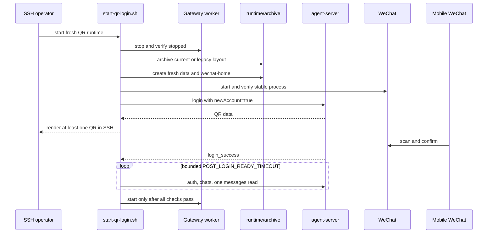

# 01 架构设计

## 当前生产架构

CFserver 使用容器内虚拟显示环境运行微信，无需宿主桌面会话。正式链路如下：

```mermaid
flowchart LR
    O["SSH operator"]
    Q["start-qr-login.sh"]
    R["Fresh runtime"]
    X["Xvfb :99"]
    D["fluxbox and dunst"]
    W["/usr/bin/wechat"]
    A["agent-server :6174"]
    V["Process + auth + chats + messages"]
    G["Gateway wechat-worker"]
    O --> Q
    Q -->|"stop worker; archive old runtime"| R
    R --> X
    X --> D
    D --> W
    W --> A
    A --> V
    V -->|"start only after verification"| G
```

- Xvfb 使用 `DISPLAY=:99` 和 `1280x800x24`。
- Gateway 通过 `http://cf-agent-wechat:6174` 调用 agent-server。
- 生产设置为 `ENABLE_VNC=0`。
- 唯一生产启动入口为 `./scripts/start-qr-login.sh`，每次使用全新 runtime 和二维码。
- 本仓库只能在脚本运行后停止并复核 worker；Gateway boot/restart stop gate 必须在
  CFserver 实机验证。

VNC、noVNC、x11vnc、websockify、宿主 X11 挂载、宿主 XFCE 和 RDP 均不在
当前生产链路中。它们只可能出现在明确标为“历史实验、已废弃、非当前生产方案”
的旧记录里。

## 组件职责

| 组件 | 职责 | 边界 |
| --- | --- | --- |
| Xvfb | 在容器内提供 `:99` 虚拟显示器 | 不依赖宿主 X11 |
| fluxbox | 管理容器内微信窗口 | 不由宿主 XFCE 管理 |
| dunst | 提供容器内通知组件 | 不提供远程桌面 |
| WeChat Linux 客户端 | 维持微信会话和客户端进程 | 手机操作仍可能是登录前置条件 |
| agent-server | 提供健康、登录、聊天和消息接口 | 不负责 AI 推理 |
| CF_agent-gateway | 通过 `cf-internal` 调用本服务 | 内部权限与编排不属于本项目 |

容器使用镜像默认启动流程，不使用自定义 entrypoint 覆盖。

## 部署边界

正式 Compose 为 `docker/compose.cfserver.yaml`，生命周期入口为
`start-qr-login.sh`/`stop-qr-runtime.sh`。正式容器为 `cf-agent-wechat`。该配置：

- 挂载
  `${CF_AGENT_WECHAT_RUNTIME_ROOT:-/srv/storage/cf-agent-wechat/runtime}/data` 到
  `/data`，同根 `wechat-home` 到 `/home/wechat`。
- 将 root-only Token 只读挂载到 `/data/auth-token`。
- 设置 `ENABLE_VNC=0`，配置 6174 健康检查。
- 接入外部网络 `cf-internal`，使用 `restart: on-failure:3`，不自动恢复旧会话。

`docker/docker-compose.yml` 是实验室或验证配置，不得作为 CFserver 正式配置。
生命周期操作见 [CFserver 正式部署](deployment/cfserver-production.md)。

## 登录控制流

`logged_in` 不再短路 forced login。强制路径必须实际渲染 QR，登录后 API 使用有界
等待。2026-08-13 已信任设备的 `phone_confirm` 只属于历史基线；当前完整流程仍待
CFserver 实机验证。详细说明见 [微信登录管理](login-management.md)。

## 网络与调用关系

`cf-agent-wechat` 和 `CF_agent-gateway` 接入 `cf-internal`。截至 2026-08-13，
Gateway 已通过 `http://cf-agent-wechat:6174` 调用并验证：

- `/health`
- `/api/status/auth`
- `/api/chats`
- `/api/messages/{chat_id}`

这只证明本项目接口及网络访问可用，不证明 Gateway 内部权限、Hermes 或企业业务
逻辑已经完成。

## 数据与认证

当前运行单元为 `/srv/storage/cf-agent-wechat/runtime/data` 和
`runtime/wechat-home`；Token 仍是独立的 `secrets/auth-token`。每次启动把旧 runtime
移入 `session-archive/<UTC时间戳>/`。首次上线只有 legacy `data`/`wechat-home` 时，
两者进入同一个归档；新旧布局并存时 fail-fast。

Token 目录为 `root:root 700`，Token 文件为 `root:root 600`，不得进入 runtime 或
归档。start/stop 共用 `/run/lock/cf-agent-wechat-qr-runtime.lock`；dry-run 在加锁前
返回，不创建该文件。

## 健康与登录是不同状态

容器 `healthy` 或 auth `logged_in` 都不等于生产可用。正确判断顺序为：

1. Compose 容器运行。
2. agent-server 可访问。
3. `/usr/bin/wechat` 真实进程持续存在。
4. auth 返回 `logged_in`。
5. `/api/chats` 可读。
6. 启动放行前，chats 非空且对 API 返回的一个聊天读取 messages 成功。

`status.sh` 只有进程、auth、chats 同时通过才返回生产可用。`logged_out`、进程不存在
或消息 API 不可读都必须回到 forced-QR 生命周期；步骤见 [故障排查](troubleshooting.md)。

## 项目边界

本项目提供微信入口、登录管理、消息接口和 Gateway 网络访问。Gateway 内部身份、
权限、Hermes 调用、Skills 与企业系统均是外部边界。
