# CFserver 生产部署与运维

本文是 `CF_agent-wechat` 在 CFserver 上的生产部署权威说明。正式 Compose 为
`docker/compose.cfserver.yaml`，正式环境文件为 `docker/.env`，正式容器名为
`cf-agent-wechat`。

> [!IMPORTANT]
> 生产环境分为“Bootstrap 基础准备”和“人工 forced fresh QR 启动”两个阶段。
> Bootstrap 不登录微信，也不启动 `agent-wechat` 或 `wechat-worker`。Debian 重启、
> 容器重建或人工重新启动微信入口后，必须在受控 SSH TTY 运行
> `./scripts/start-qr-login.sh` 并用手机扫描全新二维码。

> [!CAUTION]
> 不得执行 `docker compose down`，也不得用 `docker compose up` 或 `restart` 代替
> 生命周期脚本。`docker/docker-compose.yml` 是实验配置，不是 CFserver 正式配置。

## 生产状态

- 正式 Compose：`docker/compose.cfserver.yaml`
- 正式环境文件：`docker/.env`
- 正式容器：`cf-agent-wechat`
- 镜像：经批准的不可变 digest
- 容器显示：Xvfb `:99`，`1280x800x24`
- 窗口组件：fluxbox、dunst
- 应用：`/usr/bin/wechat`、agent-server `:6174`
- VNC：`ENABLE_VNC=0`
- 网络：外部 `cf-internal`
- 容器重启策略：`"no"`
- Bootstrap 入口：`sudo ./scripts/bootstrap-cfserver.sh`
- 唯一启动入口：`./scripts/start-qr-login.sh`
- 停止入口：`./scripts/stop-qr-runtime.sh`

`restart: "no"` 是生产生命周期的一部分。进程 crash、Docker daemon 重启和 Debian
重启都不得自动恢复 `agent-wechat`，更不得复用旧 session。只有人工 forced-QR
入口可以创建并启动新的生产 runtime。

## 组件与放行门槛

```mermaid
flowchart LR
    B["bootstrap-cfserver.sh"]
    O["start-qr-login.sh"]
    R["全新 runtime"]
    X["Xvfb / fluxbox / dunst"]
    W["/usr/bin/wechat"]
    A["agent-server :6174"]
    V["进程 + auth + chats + messages 验证"]
    G["Gateway wechat-worker"]

    B -->|"只准备；不启动、不登录"| O
    O -->|"停止 worker，归档旧 runtime"| R
    R --> X
    X --> W
    W --> A
    A --> V
    V -->|"全部通过后才启动"| G
```



Gateway 经 `cf-internal` 的固定 alias `cf-agent-wechat` 访问 Agent API。启动脚本
只控制 `wechat-worker` 的停止和启动，不启停 `dispatch-worker` 或
`delivery-worker`，不修改 Gateway 代码、配置数据库、PostgreSQL、Checkpoint 或
Hermes 数据。Gateway 和 Hermes 上下文仍由各自数据库持久化。

因此，本仓库只能保证脚本取得控制后执行 stop/verify/start，不能保证 Debian 或 Docker
启动到人工执行脚本之前 worker 已停止。Gateway restart/boot stop gate 是 CFserver
实机验收前置条件，不得写成由本仓库代码保证。

脚本取得控制后会在 Archive、Agent start、QR、运行态验证和最终 release 边界重复证明
Worker stopped，并在 QR 等待期间检测、停止任何外部启动后失败退出。该消费者侧撤销
仍不是原子排他；Gateway compatible producer 必须提供绑定当前 fresh runtime generation
的 deny-by-default release gate，确保 direct Compose、supervisor 和 stale release 都
不能绕过扫码后的完整验证。

## 生产目录

代码目录：

```text
/opt/cf-agent-wechat/
├── docker/
│   ├── compose.cfserver.yaml
│   └── .env
└── scripts/
    ├── start-qr-login.sh
    ├── stop-qr-runtime.sh
    ├── status.sh
    └── login.sh  # 仅兼容包装，无条件 exec 到 start-qr-login.sh
```

agent-wechat 的 Compose、环境文件和项目目录固定为
`/opt/cf-agent-wechat/docker/compose.cfserver.yaml`、
`/opt/cf-agent-wechat/docker/.env` 和 `/opt/cf-agent-wechat`。生产入口不接受路径
覆盖；非标准路径只用于显式 `CF_AGENT_WECHAT_TESTING=1` 的隔离测试。

Gateway 生产布局固定为：

```text
/opt/cf-agent-gateway/
├── docker-compose.prod.yml
├── .env
└── deploy/
    ├── wechat-runtime-contract.json
    └── check-wechat-worker-heartbeat
```

Gateway Compose project 为 `cf-agent-gateway`，profile/service 均为 `worker`；
本文所称 WeChat worker 指该 service。生命周期脚本不接受调用环境覆盖这些路径或身份。

contract 和 checker 必须由 Gateway 仓库兼容 commit 部署，不能是手工文件。checker
必须无参数、无输出，并在 10 秒内同时确认当前 `worker` running、Docker health
正常、heartbeat 不超过 30 秒、最新 Poll Cycle 成功和 auth=`logged_in`。缺文件、
版本不兼容、Token 不一致、checker 非零/超时/有输出都 fail closed。Gateway PR #4
当前尚无兼容 producer，状态为 **BLOCKED BY GATEWAY CONTRACT**；完整固定值见
[Gateway-WeChat Runtime Contract v1](../contracts/gateway-wechat-runtime-contract.md)。

存储目录：

```text
/srv/storage/cf-agent-wechat/
├── runtime/
│   ├── data/
│   └── wechat-home/
├── session-archive/
│   └── <UTC时间戳>/
│       ├── data/
│       ├── wechat-home/
│       └── manifest.json
└── secrets/
    └── auth-token
```

- `runtime/data` 挂载到 `/data`。
- `runtime/wechat-home` 挂载到 `/home/wechat`。
- `secrets/auth-token` 单独只读挂载到 `/data/auth-token`。
- `session-archive` 保存完整旧 Runtime 与 schema v2 manifest；payload 按 `restricted` 管理。

Token 不属于 runtime。移动 runtime 时不得移动、复制或读取 Token 内容。
旧 runtime archive 本身可能包含历史微信 session、缓存和消息数据，必须保持
root-protected，且永远不能挂回生产复用。

首次上线 forced-QR 模式前可能仍有 legacy
`${STORAGE_ROOT}/data`、`${STORAGE_ROOT}/wechat-home`。只有 legacy 布局时，脚本把
存在的两个目录迁入同一个时间戳归档；新 runtime 与任一 legacy 目录并存时 fail-fast，
不修改任一布局。

## Docker Host 契约

生产只允许受信任的 Debian 固定系统工具；Bootstrap 对生产工具路径和元数据 fail closed。
`/usr/bin/docker`、`/usr/bin/systemctl`、`/usr/bin/timeout` 和
`/usr/bin/openssl` 不得由普通用户 PATH 替换。Docker context 必须为 default，endpoint
必须是 `unix:///var/run/docker.sock`；`/var/run/docker.sock` 必须是真实 Unix
socket 且不是符号链接。daemon 必须为 rootful 并配置 `live-restore=false`。任一条件
不满足时 Bootstrap 和生产生命周期脚本都不得继续。

## Compose 约束

`docker/compose.cfserver.yaml` 必须保留：

- 现有不可变镜像 digest 输入；
- `security_opt: seccomp=unconfined`；
- `SYS_PTRACE`；
- `ENABLE_VNC=0`；
- 外部 `cf-internal` 网络及固定 alias `cf-agent-wechat`；
- 6174 仅绑定 loopback；
- 现有 healthcheck；
- JSON 日志大小和文件数限制；
- `restart: "no"`。

不得新增公网端口。

`seccomp=unconfined` 和 `SYS_PTRACE` 是当前上游镜像要求，不是一般性安全默认值。
每次镜像 digest 变化都必须重新审查其必要性、影响和可替代方案。Compose healthcheck
只证明容器和 Agent API 健康，不能证明微信已登录、chats/messages 可读或 Gateway 链路
可用。

运行目录挂载必须为：

```yaml
- ${CF_AGENT_WECHAT_RUNTIME_ROOT:-/srv/storage/cf-agent-wechat/runtime}/data:/data
- ${CF_AGENT_WECHAT_RUNTIME_ROOT:-/srv/storage/cf-agent-wechat/runtime}/wechat-home:/home/wechat
```

Token 继续使用独立只读挂载：

```yaml
- /srv/storage/cf-agent-wechat/secrets/auth-token:/data/auth-token:ro
```

`CF_AGENT_WECHAT_RUNTIME_ROOT` 只覆盖当前运行目录，不得指向 `secrets` 或
`session-archive`。为保证原子归档，覆盖路径必须满足启动脚本对同一受控文件系统的校验。

## 生产环境输入

`docker/.env` 为 root-protected、单 hardlink、非 symlink 的白名单字面值文件。以下
键必须全部存在；不得加入 Token、密码或任意 shell 语法：
metadata 只能是以下精确元组：

- `root:root 0600`；
- 固定管理用户及其 primary GID，mode `0600`；
- owner 为 root 或固定管理用户、group 精确为 `CF_AGENT_WECHAT_MANAGEMENT_GID`，
  mode `0640`。

owner 合法但 group 漂移同样 fail closed，已验证 metadata 会在 Archive preflight 再次复核。

| 键 | 精确生产合同 |
| --- | --- |
| `COMPOSE_PROJECT_NAME` | 固定 `cf-agent-wechat` |
| `AGENT_WECHAT_IMAGE` | 批准的完整 `name@sha256:<64 hex>`，禁止 tag-only/`latest` |
| `AGENT_WECHAT_BIND_IP` / `PORT` | `127.0.0.1` / 批准端口；容器 target 固定 6174/tcp |
| `AGENT_WECHAT_CONTAINER_NAME` | 批准容器名，默认合同 `cf-agent-wechat` |
| `CF_AGENT_WECHAT_STORAGE_ROOT` | 固定 `/srv/storage/cf-agent-wechat` |
| `CF_AGENT_WECHAT_RUNTIME_ROOT` | 固定 `/srv/storage/cf-agent-wechat/runtime` |
| `CF_AGENT_WECHAT_ARCHIVE_ROOT` | 固定 `/srv/storage/cf-agent-wechat/session-archive`，与 runtime 同文件系统 |
| `CF_AGENT_WECHAT_RUNTIME_UID` / `GID` / `MODE` | 批准非 root UID/GID，默认 `1000:1000`；mode 固定 `700` |
| `CF_AGENT_WECHAT_MANAGEMENT_GID` | 批准的非 root 管理组，用于 mode `0640` 运行锁 |
| `CF_AGENT_WECHAT_MIN_FREE_BYTES` | Archive 最少可用字节，默认合同 `1073741824` |
| `CF_AGENT_WECHAT_MIN_FREE_PERCENT` | Archive 最少可用百分比，默认合同 `10` |
| `CF_AGENT_WECHAT_MIN_FREE_INODES` | Archive 最少可用 inode，默认合同 `1024` |
| `CF_AGENT_WECHAT_TOKEN_SCAN_MAX_FILES` | Runtime/Archive 安全扫描最大普通文件数 |
| `CF_AGENT_WECHAT_TOKEN_SCAN_MAX_BYTES` | Runtime/Archive 安全扫描最大总字节 |
| `PROXY` | 空值或无凭证的 `http/https/socks5/socks5h://host:port` |
| `RUST_LOG` | 仅 `error`、`warn` 或 `info` |

生产入口拒绝调用进程中的 `API_URL`、`WS_URL`、`TOKEN_FILE`、`SESSION_ID`、
Python/venv、Agent/Compose、Proxy、Runtime/Archive 和 Gateway 管理覆盖。API 与
WebSocket URL 只由批准 loopback/port 派生，Token 路径固定为
`/srv/storage/cf-agent-wechat/secrets/auth-token`，session 固定 `default`。
`CF_AGENT_WECHAT_TESTING=1` 是唯一测试覆盖门禁，不属于生产运行方式。

Compose 调用先以 `env -u` 语义清除 Docker/Compose/Agent/Gateway/Proxy 同名宿主变量，
再显式注入解析后的批准值。渲染和实际容器都精确核验 project、image、container、
`restart=no`、mount、loopback port、`cf-internal` alias、`PROXY` 与 `RUST_LOG`；
不只是检查“某个 digest”。Token 不进入 Compose config、container environment 或
inspect。不要在普通 shell 裸跑 `docker compose config/up/ps`；静态验证使用
`sudo ./scripts/bootstrap-cfserver.sh`，生产启停使用生命周期脚本。

## Bootstrap 基础准备

首次部署时执行。已运行环境的部署输入发生变化时，必须先运行
`./scripts/stop-qr-runtime.sh`，确认 Agent/Worker 均已停止，再执行：

```bash
cd /opt/cf-agent-wechat
sudo ./scripts/bootstrap-cfserver.sh
```

Bootstrap 必须可以在配置修复后安全重试。它只完成以下基础准备：

1. 确认代码、管理脚本、Compose 和 `docker/.env` 为批准的非 symlink、单 hardlink、
   owner/mode 合规文件；安全解析完整白名单，不执行内容。
2. 校验 systemd、`docker.service`、固定系统工具、真实
   `/var/run/docker.sock`、default context、local rootful endpoint、
   `live-restore=false` 和 Docker Compose v2；拒绝 remote/rootless。
3. 拒绝已启用的 `cf-agent-wechat.service` 或名称可匹配 Agent 的其他 auto-start
   systemd unit，并确认 Agent 未作为长期服务运行。
4. 校验固定生产存储路径、mixed layout、Archive root、secrets/Token 与管理锁父目录；
   Runtime/legacy 目录必须精确等于批准非 root UID/GID 和 mode `700`，不继承漂移。
5. 创建或复用唯一 root-only Agent Token，并确认它在 runtime/archive 外；校验 Gateway
   contract v1、固定 checker、file credential pointer 和唯一只读 Token bind，不
   source/eval Gateway `.env`，也不静默改写它。
6. 校验 `cf-internal` 为 local bridge，并对 clean-environment Compose JSON 做精确
   attestation：批准 image/project/container、`restart=no`、三项 mount、loopback port、
   固定 alias、`PROXY`、`RUST_LOG`、`seccomp=unconfined` 和 `SYS_PTRACE`。
7. 真实运行 `python3 -m venv` 创建临时环境，确认 ensurepip/pip 可执行；不是只检查
   `import venv`。
8. 确认 Gateway 固定项目 `cf-agent-gateway` 的 profile/service `worker` 可渲染；
   Bootstrap 不运行 checker 来伪造登录或 heartbeat 成功。
9. 在 CFserver 实机确认 Gateway restart/boot stop gate，确保 Debian 启动到人工脚本前
   `worker` 持续停止；该保障不属于本仓库。

Bootstrap 不创建微信 session、不创建登录成功标记、不启动 `agent-wechat`，也不启动
`wechat-worker`。完成只表示基础部署准备完成；下一步始终是
`./scripts/start-qr-login.sh`。失败时 fail closed，不删除 archive，不输出 Token，
修复配置后重新运行 Bootstrap。

## 唯一登录与启动流程

```bash
cd /opt/cf-agent-wechat
./scripts/start-qr-login.sh
```

该命令必须由人工在受控 SSH TTY 中运行。Bootstrap 不能替代它。

脚本必须按顺序：

1. 校验受控 SSH TTY，拒绝全部生产管理环境覆盖，并安全读取固定 `docker/.env`。
2. 在任何 Worker/Archive/QR 变更前重新校验 systemd、`docker.service`、local rootful
   default Docker、socket、`live-restore=false`、auto-start unit、`cf-internal`、
   Gateway contract/Token 和 clean Compose 精确 attestation。
3. 精确检查现有 Runtime 或 legacy `data`/`wechat-home` 的批准 UID/GID/mode；使用
   有界 no-follow scanner 拒绝 symlink/hardlink、FIFO/socket/device、跨文件系统内容，
   并确认树中没有独立 Agent Token。
4. 获取 owner/group/mode/link-count 均合规的 `0640` 独占管理锁。
5. 停止并确认 Gateway `worker`。
6. 检查 Archive 可用 bytes、百分比和 inode，运行受限 inventory；失败时 Worker 保持
   停止，不移动 Archive、不显示 QR。
7. 验证固定 `/usr/bin/python3`、仓库 Hash lock 与 passwd home 下 QR venv；正确环境
   快速复用，不匹配则在 hard timeout 内事务式重建。失败时不变更 Agent/Archive，
   Worker 保持停止。helper 快照所有现存路径祖先的 device/inode/owner/group/mode/type，
   并在 venv、pip、验证、stamp、cleanup 与 rollback 前后重验；漂移后停止路径操作。
8. 把 Token 读入仅当前进程内存；Token 不进入 argv、
   environment、inspect、Compose config、日志或错误。
9. 停止并删除旧 `agent-wechat` 容器，不执行 Compose `down`；原子归档当前 Runtime，
   或把 legacy 两目录迁入同一个 UTC Archive。
10. 始终以 `CF_AGENT_WECHAT_RUNTIME_UID/GID/MODE` 批准值创建全新的
   `runtime/data` 和 `runtime/wechat-home`，不继承旧目录漂移。
11. 以 `restart: "no"` 创建容器，立即用 Docker inspect 精确核验实际 image、name、
    project、RestartPolicy、mount、loopback port、network alias 和 environment；偏离时
    cleanup 并失败，不显示 QR。
12. 等待容器 running/healthy、Agent API 和 canonical `/usr/bin/wechat`
    `PID:start_time` 稳定，再以 `newAccount=true` 请求 fresh QR。
13. SSH 终端必须实际渲染至少一个 QR，之后才接受手机确认和登录成功事件。
14. 在有界窗口内验证同一 WeChat 进程、auth=`logged_in`、chats 非空，并读取一个
    API 返回 chat 的 messages。
15. 只有全部通过才启动 Gateway `worker`；contract checker 在稳定窗口内持续无输出且
    返回 0 才成功。checker stale、失败、超时或输出内容时立即撤销 Worker 放行，Agent
    与 Archive 现场保留。

进入 agent 容器轮换阶段后，后续任何失败都会触发统一 cleanup：脚本尝试重新停止并
确认 worker，再依次 stop/remove `agent-wechat`。remove 使用
`compose rm --force`，不带 `-v`，也不执行 `down` 或删除 volume；已有 runtime、归档
及其中已落盘的持久文件不由 cleanup 删除。只有 worker stop 与 agent stop/remove 均
成功确认时，才能认定 AI 调度已停止且失败容器不会在 Docker daemon 或 Debian 重启后
恢复。Docker json-file 容器日志不由脚本采集，必须在等待阶段或通过外部日志系统留存。

cleanup 失败会单独报告；归档已建立且 failed manifest 更新成功时，两步结果写入
manifest。cleanup 或 manifest 更新失败都不覆盖原失败阶段和退出结果，重启 Docker 或
Debian 前必须人工核验残留状态。只有完整成功流程保留运行中的 agent 容器并启动 worker。

若初始 worker stop 无法确认，脚本立即失败并报告“无法确认”；本仓库不能声称 worker
已停止。配置、锁和 Token 读取等进入 agent 容器轮换前的失败不会删除既有容器。

### Dry run

```bash
./scripts/start-qr-login.sh --dry-run
```

Dry run 不修改目录、容器或 worker，并在获取锁前返回；它不得创建空 runtime、归档或
`/run/lock/cf-agent-wechat-qr-runtime.lock`。

### 并发与重复执行

start/stop/retention 共用 `/run/lock/cf-agent-wechat-qr-runtime.lock` 的 `flock`。
锁文件必须为空、非 symlink、单 hardlink，精确使用批准 owner、
`CF_AGENT_WECHAT_MANAGEMENT_GID` 和 mode `0640`；普通非管理用户不能打开并持锁。
空文件可以保留，文件存在不代表锁正被持有，进程退出会释放 flock。重复 fresh QR 使用
新的 UTC 时间戳目录，绝不覆盖既有 Archive。

## 停止

```bash
cd /opt/cf-agent-wechat
./scripts/stop-qr-runtime.sh
```

停止脚本先停止 `wechat-worker`，再停止 `agent-wechat`。它不删除 runtime、Token 或
归档。`--dry-run` 只预览动作，并在获取锁前返回，不创建或遗留锁文件。

停止后的 runtime 不会在下次启动时恢复；下次启动先归档它，再要求新的二维码。

## 登录行为

`start-qr-login.sh` 必须直接使用 `newAccount=true` 请求和监听 fresh QR。若全新
runtime 仍返回 `logged_in`，脚本不得短路成功，而应返回：

```text
runtime is not clean; use start-qr-login.sh
```

登录工具不执行 UI logout，不删除用户数据。HTTP 响应或 WebSocket 事件必须在当前 SSH
终端实际渲染至少一个 QR；未渲染 QR 时拒绝接受 `login_success`。二维码不进入日志或
验证记录。`login.sh` 只无条件 `exec` 到唯一入口，不提供替代路径。

forced production 只接受能够在渲染前检查 Token 的文本 QR payload。PNG-only
`qrDataUrl` 无法在当前依赖下可靠审计，必须 fail closed；不得绕过检查或把 PNG
二维码写入文件。

## 生产可用状态

`status.sh` 至少显示：

- `Container`
- `Agent Server`
- `WeChat Process`
- `Auth`
- `QR Runtime Mode`
- `Message API`
- `Gateway WeChat Worker`

`WeChat Process` 仅表示 canonical executable 精确匹配且同一 `PID:start_time`
身份稳定；同名进程、仅 PID 相同或命令行包含 `wechat` 均不足以通过。进程身份不存在
或 `/api/chats` 不可读时必须非零退出。只有进程身份、auth 和 chats 都通过时，状态
才为生产可用。账号和聊天 ID 不得输出。

容器 `healthy`、WebSocket `login_success` 或 auth `logged_in` 任一单项都不足以证明
生产可用。worker 放行还要求 chats 非空和 messages 读取成功。

## Archive 与 Manifest

Archive 是完整旧 Runtime，可能包含 WeChat session、账号/聊天标识、消息元数据和内容，
整体为 `restricted` 敏感资产。不得自动上传、分享、加入 CI artifact 或挂回生产；
独立 Agent API Token 被严格禁止进入 payload。

隔离扫描以 no-follow/no-cross-filesystem 方式检查普通文件内容和目录项名称的原始字节，
拒绝任何 xattr/POSIX ACL、额外 hardlink 和特殊文件；失败发生在二维码之前且不输出
路径内容或 Token。`docker/.env` 的 entry 上限不得超过 200,000；扫描器的编译上限同为
200,000 entry，attestation 累计编码相对路径另有 64 MiB 硬上限。扫描通过不表示
Archive 已去标识化，也不替代“容器已停止、部署 principal 受信”的写入者边界。

Manifest schema v2 使用 `manifestData` 表示 manifest 自身不含实际 Token/账号/Chat ID/
消息正文；`archivePayloadClassification` 则明确 payload 可能包含这些 WeChat 数据，
`productionSessionRecoveryAllowed=false` 始终固定。只有移动后的隔离扫描验证通过，
`containsIndependentAgentApiToken` 才为 `false` 且扫描状态为 `verified`；预扫或失败状态
下该字段为 `null`，流程 fail closed。schema v1 按未知且 restricted 兼容读取，不原地
改写，也不推断它不含敏感数据。

每次启动先停止并确认 Worker，再在 Archive/QR 变更前检查 bytes/percent/inode 三项
阈值并输出 inventory。门禁失败时 Worker 保持停止。
容量不足、Archive symlink、路径逃逸、额外 hardlink、特殊文件、跨文件系统或 inventory
超限/超时都 fail closed，且不会自动清理。独立 retention 工具默认 dry-run；实际删除
必须明确一个 UTC Archive、增加 `--execute --confirm DELETE:<name>`、在 TTY 二次确认，
并写受保护审计。完整命令、schema、受限备份和 v1 兼容规则见
[Archive Management Contract](../archive-management.md)。

## Debian 重启、重建和回滚

进程 crash、Docker daemon restart 或 Debian/Host restart 后，不等待容器自动恢复旧
会话。`restart: "no"` 与 Docker `live-restore=false` 要求 Agent 保持停止；部署
输入没有变化时，恢复流程为：

```text
SSH -> start-qr-login.sh -> 手机扫码 -> 自动验证 -> worker 启动
```

显式 `docker compose up --force-recreate` 会启动容器，不属于上述自动重启保证，也
禁止作为生产恢复入口。重建、升级或回滚必须严格按以下顺序：

1. 在旧的已批准代码、Compose 和环境输入下运行 `stop-qr-runtime.sh`，确认
   Agent/Worker 均已停止。
2. 修改到新的已批准 Commit、Compose、环境输入或镜像 digest。
3. 运行 Bootstrap 验证新输入，不启动 Agent/Worker。
4. 人工运行 `start-qr-login.sh`，扫描新二维码并完成完整验证。

- cleanup 已确认 remove 成功时，不存在可由 Docker daemon 重启恢复的 agent 容器。
- 容器重建后不挂载旧会话继续工作。
- 镜像或代码回滚后仍创建全新 runtime。
- 旧运行目录只归档，不恢复为活跃登录态。
- Token 保持独立只读挂载。
- 完整验证前 worker 保持停止。

最后一项仅描述启动脚本确认 stop 之后的阶段。本仓库未修改 Gateway，不能保证 Debian
启动至脚本执行前 worker 已停止；该 boot stop gate 必须在 CFserver 实机重启验证。

重启期间发送给机器人的消息可能不会被本地微信补拉。必须等 worker 启动后再发送业务
消息。

## 安全边界

- 固定管理用户及 `CF_AGENT_WECHAT_MANAGEMENT_GID` 对应的批准管理组属于 trusted
  deployment principal。其账户、组成员资格和仓库写权限必须按 root 等级审批，不得授予
  普通用户；Docker access 本身等价于 root 权限。
- inode/FD/content metadata 与稳定 snapshot 防止并发混合加载，但同一受信任 UID 仍可
  修改其自有管理文件或自身进程。脚本不声称抵御恶意 root、已失陷的 trusted principal，
  或在检查前已持有旧 inode 可写 FD 的进程；元数据防护不能替代该信任边界。Runtime、
  container、Worker 和 CI runner 不会因此自动成为生产 deployment principal。
- 不执行 Compose `down`。
- 不修改 PostgreSQL、Gateway 或 Hermes 数据库。
- 不修改 `CF_agent-gateway` 或其他仓库。
- 不新增公网端口。
- 不输出 Token、二维码、微信账号、联系人、聊天 ID、聊天正文、API Key 或密码。
- VNC、noVNC、x11vnc、websockify、宿主 X11、XFCE 和 RDP 均不属于生产流程。
- CFserver Host 时区为 `Asia/Shanghai`；容器和日志使用 UTC。展示层可以转换时区，
  archive manifest 和原始审计证据保持 UTC。
- `seccomp=unconfined` 与 `SYS_PTRACE` 必须持续安全审查。

## 实机验证边界

2026-08-13 的已信任设备登录和 2026-08-14 的消息接口证据属于旧生产基线。它们不能
替代本次强制全新二维码流程的 CFserver 现场验证。

`restart=no Docker policy fixture` 已在真实 Docker daemon 上用 Alpine/Nginx 容器
覆盖正常退出、异常退出和 daemon restart 后保持停止。对应 commit 的成功 GitHub Actions run
只证明此 fixture，Run ID 记录在 PR #3。它不运行实际 agent-wechat 镜像、WeChat 进程或 QR，也不执行
真实 Host reboot；实际 Agent、Host、Gateway boot stop gate 和真实手机扫码仍必须在
CFserver 验证。

本变更合入后仍需在 CFserver 完成一次真实手机扫码，并验证 legacy 首次迁移、mixed
layout fail-fast、终端实际 QR、锁、API 有界等待、WeChat 进程稳定和脚本内 worker
放行。还必须单独验证 Debian 启动到脚本执行前的 Gateway boot stop gate；本仓库不能
代替该现场证据。验证记录必须脱敏。
当前状态见 [验证总览](../validation.md)。
