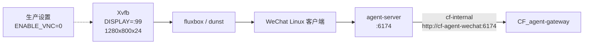

# CFserver 生产部署与运维

本文是 `CF_agent-wechat` 在 CFserver 上的生产部署权威说明。当前正式部署由
`docker/compose.cfserver.yaml` 管理，正式容器名为 `cf-agent-wechat`。

> [!CAUTION]
> **不得在 CFserver 上执行不带 `-f` 的 `docker compose down`。**
> 所有生产 Compose 命令都必须显式指定
> `-f docker/compose.cfserver.yaml`。仓库中的 `docker/docker-compose.yml`
> 是实验室或验证配置，不是 CFserver 正式配置。

## 当前生产状态

- 正式部署文件：`docker/compose.cfserver.yaml`
- 正式容器：`cf-agent-wechat`
- 容器显示环境：`DISPLAY=:99`
- 虚拟显示器：Xvfb，`1280x800x24`
- 窗口及通知组件：fluxbox、dunst
- 应用组件：WeChat Linux 客户端、agent-server
- VNC 开关：`ENABLE_VNC=0`
- 统一 Docker 网络：`cf-internal`
- Gateway 访问地址：`http://cf-agent-wechat:6174`

当前生产链路不包含 VNC、noVNC、x11vnc、websockify、宿主 X11 挂载或
RDP 操作微信，也不使用宿主 XFCE 管理微信窗口。容器未配置自定义 entrypoint
覆盖，使用镜像的默认启动流程。

## 组件拓扑



VNC、noVNC、x11vnc、websockify、宿主 X11 和 RDP **不在上述生产链路中**。
`CF_agent-gateway` 仅作为调用方通过 `cf-internal` 访问本项目；其内部权限与
业务编排不属于本项目文档范围。

## 生产目录

生产代码目录：

```text
/opt/cf-agent-wechat/
├── docker/
│   └── compose.cfserver.yaml
└── scripts/
    ├── status.sh
    └── login.sh
```

持久化目录：

```text
/srv/storage/cf-agent-wechat/
├── data/
├── wechat-home/
└── secrets/
    └── auth-token
```

- `data/`：生产持久化数据。
- `wechat-home/`：微信用户目录持久化数据。
- `secrets/auth-token`：agent-server 认证 Token，仅允许受控读取。

Token 目录及文件权限必须保持：

```text
/srv/storage/cf-agent-wechat/secrets             root:root 700
/srv/storage/cf-agent-wechat/secrets/auth-token  root:root 600
```

不得将 `auth-token` 改为 `644`，不得在命令、日志、截图或文档中打印 Token
实值或摘要。

## Compose 配置定位

`docker/compose.cfserver.yaml` 是 CFserver 当前唯一正式生产 Compose 入口，负责：

- 创建和维护正式容器 `cf-agent-wechat`；
- 接入外部统一网络 `cf-internal`；
- 使用生产持久化目录；
- 固定无 VNC 的容器内虚拟显示架构；
- 提供容器健康检查所需的运行配置。

执行以下操作前，先进入生产代码目录：

```bash
cd /opt/cf-agent-wechat
```

## 生产环境变量输入

生产环境变量文件是宿主机上的 Docker Compose **渲染输入**：Compose 在创建容器前
用它和当前 shell 环境替换 `compose.cfserver.yaml` 中的 `${...}`。其中镜像、容器名、
宿主端口发布和持久化根目录会改变渲染后的 Compose 模型；`PROXY`、`RUST_LOG` 会
进一步作为容器环境变量传入。该文件不是 agent-server 的 Token 存储。

按本文命令从 `/opt/cf-agent-wechat` 执行且未显式传入 `--env-file` 时，Compose
按照自身优先级读取当前 shell 环境和工作目录中的默认 `.env`。若生产运维使用受控的
`--env-file`，校验、启动、重建和回滚必须始终选择同一份受控文件，不能混用输入源。
生产变量文件及其实值不进入 Git，也不得粘贴到公开文档或工单。

| 变量 | 要求与默认值 | 对生产 Compose 的作用 |
| --- | --- | --- |
| `AGENT_WECHAT_IMAGE` | 必填 | 选择运行镜像；必须使用经批准、可追溯的不可变镜像引用，例如受控 digest，不能使用 `latest` |
| `AGENT_WECHAT_BIND_IP` | 必填，无默认值 | 决定 6174 端口发布到宿主机的哪个地址；当前生产实值不在公共文档中记录 |
| `AGENT_WECHAT_PORT` | 可选，默认 `6174` | 决定宿主机发布端口；容器内 agent-server 端口仍固定为 `6174` |
| `AGENT_WECHAT_CONTAINER_NAME` | 可选，默认 `cf-agent-wechat` | 决定正式容器名 |
| `CF_AGENT_WECHAT_STORAGE_ROOT` | 可选，默认 `/srv/storage/cf-agent-wechat` | 作为 `data`、`wechat-home` 和 `secrets/auth-token` 三个宿主 bind mount 的根目录 |
| `PROXY` | 可选，默认空 | 原样传入容器；若值含认证信息，必须按敏感配置保护 |
| `RUST_LOG` | 可选，默认 `info` | 设置 agent-server 日志过滤级别；提高详细度前应评估敏感信息暴露风险 |

容器内 `AGENT_HOST=0.0.0.0`、`AGENT_PORT=6174`、`AGENT_DB_PATH=/data/agent.db` 和
`ENABLE_VNC=0` 由生产 Compose 固定，不是生产变量文件中的可选开关。Token 始终是
宿主机上的 root-only 文件，通过 `/data/auth-token` 只读挂载，禁止写入 `.env`。

> [!WARNING]
> `docker/.env.example` 是 `cf-wechat-lab` 实验模板，其中包含实验室项目名、
> `cf-agent-wechat-lab` 容器名、实验回环绑定和 `ENABLE_VNC=1`。不得将它直接复制
> 为 CFserver 生产配置，也不得据此推断任何当前生产变量值。

脚本请求地址、宿主发布和容器网络是三个独立层次：

- `status.sh`、`login.sh` 的 `API_URL` 默认值是 `http://127.0.0.1:6174`；
- 宿主发布地址由 `AGENT_WECHAT_BIND_IP` 与 `AGENT_WECHAT_PORT` 决定；
- Gateway 经 `cf-internal` 使用 `http://cf-agent-wechat:6174`。

不得根据脚本 `API_URL` 推断宿主发布地址。是否将宿主发布地址收紧到
`127.0.0.1` 是独立的待评审安全项；本文不声明当前绑定值，也不修改真实部署。

使用与实际部署相同的环境输入进行静默渲染校验：

```bash
cd /opt/cf-agent-wechat
sudo docker compose -f docker/compose.cfserver.yaml config --quiet
```

若生产流程显式使用 `--env-file`，在上述命令中加入同一受控文件。`config --quiet`
只验证解析与变量插值，不输出渲染结果，也不会读取或打印 `auth-token` 内容。不要为
排查方便执行 `cat .env`、`cat auth-token`，或把完整环境与完整 Compose 渲染结果
粘贴到日志、工单或公共文档。

## 首次部署前检查

1. 确认当前代码版本是计划部署的提交。
2. 确认 `docker/compose.cfserver.yaml` 存在，并已使用与部署相同的环境输入通过
   `config --quiet`。
3. 确认 `data/`、`wechat-home/` 和 `secrets/auth-token` 已按生产目录挂载。
4. 确认 Token 目录和文件所有者、权限分别为 `root:root 700`、
   `root:root 600`。
5. 确认外部 Docker 网络 `cf-internal` 已存在。

检查统一网络：

```bash
sudo docker network inspect cf-internal
```

检查 Token 权限时只查看元数据，不读取内容：

```bash
sudo stat -c '%U:%G %a %n' \
  /srv/storage/cf-agent-wechat/secrets \
  /srv/storage/cf-agent-wechat/secrets/auth-token
```

## 启动与停止

启动或应用当前生产配置：

```bash
cd /opt/cf-agent-wechat
sudo docker compose -f docker/compose.cfserver.yaml up -d
```

查看容器状态：

```bash
sudo docker compose -f docker/compose.cfserver.yaml ps
```

停止并移除本项目生产容器和 Compose 资源：

```bash
cd /opt/cf-agent-wechat
sudo docker compose -f docker/compose.cfserver.yaml down
```

> [!CAUTION]
> 上述 `down` 命令中的 `-f docker/compose.cfserver.yaml` 不得省略。
> 裸用 `docker compose down` 可能命中错误的 Compose 项目。

## 重建

更新代码或镜像后，先校验配置、拉取受控镜像，再重建正式服务：

```bash
cd /opt/cf-agent-wechat
sudo docker compose -f docker/compose.cfserver.yaml config --quiet
sudo docker compose -f docker/compose.cfserver.yaml pull agent-wechat
sudo docker compose -f docker/compose.cfserver.yaml up -d --force-recreate agent-wechat
sudo docker compose -f docker/compose.cfserver.yaml ps
```

不要在重建过程中删除生产持久化目录，也不要通过放宽 Token 权限规避读取失败。

## 日志与健康状态

查看生产日志：

```bash
cd /opt/cf-agent-wechat
sudo docker compose -f docker/compose.cfserver.yaml logs
```

持续跟踪日志：

```bash
sudo docker compose -f docker/compose.cfserver.yaml logs -f
```

查看 Compose 状态：

```bash
sudo docker compose -f docker/compose.cfserver.yaml ps
```

查看容器健康信息：

```bash
sudo docker inspect --format '{{json .State.Health}}' cf-agent-wechat
```

健康检查应结合容器状态、应用日志和登录状态判断。容器健康不等同于微信已经登录。

## 微信登录

登录管理统一从脚本入口执行：

```bash
cd /opt/cf-agent-wechat
./scripts/status.sh
./scripts/login.sh
```

- 已登录时，`login.sh` 会短路，不重复启动登录流程。
- 未登录时，脚本启动登录流程并等待手机侧确认或扫码。
- 当前已实机验证的是“已信任设备 -> 手机确认 -> 登录成功”。
- “完全新设备 -> SSH 终端显示二维码 -> 手机扫码 -> 登录成功”已经实现为预期流程，
  但尚未完成实机验证，不能作为已验证能力承诺。

登录完成后再次执行：

```bash
./scripts/status.sh
```

登录脚本的完整行为、返回码和异常处理见
[登录管理](../login-management.md)。

## CFserver 重启后检查

CFserver 重启后按顺序检查：

1. 确认生产容器已启动且健康。
2. 确认容器环境仍为 `DISPLAY=:99`、`ENABLE_VNC=0`。
3. 确认 Xvfb、fluxbox、dunst、WeChat 和 agent-server 均在运行。
4. 确认 x11vnc、websockify 未运行。
5. 使用 `status.sh` 复核微信登录状态。
6. 确认容器仍接入 `cf-internal`。
7. 从调用侧确认 `http://cf-agent-wechat:6174` 可达；调用侧内部故障交由
   `CF_agent-gateway` 项目处理。

基础检查命令：

```bash
cd /opt/cf-agent-wechat
sudo docker compose -f docker/compose.cfserver.yaml ps
sudo docker compose -f docker/compose.cfserver.yaml logs
./scripts/status.sh
sudo docker inspect --format '{{range $name, $_ := .NetworkSettings.Networks}}{{$name}} {{end}}' cf-agent-wechat
sudo docker exec cf-agent-wechat sh -lc \
  "ps -ef | grep -E '[X]vfb|[f]luxbox|[d]unst|[w]eixin|[w]echat|[a]gent-server'"
sudo docker exec cf-agent-wechat sh -lc \
  "! ps -ef | grep -E '[x]11vnc|[w]ebsockify'"
```

进程名可能随上游镜像版本变化；若进程检查与日志不一致，以实际镜像内进程和
健康检查定义为准，且不得因此改用 VNC、宿主 X11 或 RDP。

## 回滚原则

1. 回滚前记录当前提交、镜像标识、容器状态和必要日志，不记录 Token 内容。
2. 只回退到已知可用且与持久化数据兼容的代码与镜像版本。
3. 保留 `/srv/storage/cf-agent-wechat/data` 和 `wechat-home`，不得以清空持久化
   数据作为常规回滚手段。
4. 保持 `secrets/auth-token` 的 `root:root 600` 权限；不得复制到仓库或写入
   Compose 文件。
5. 回滚后始终使用生产 Compose 重新部署并执行完整的重启后检查。
6. 若回滚涉及数据格式或持久化目录变更，先制定可逆的数据备份和恢复步骤，
   再执行部署操作。

回滚部署命令仍必须显式指定生产 Compose：

先将生产环境中的 `AGENT_WECHAT_IMAGE` 恢复为已记录、不可变的上一可用镜像引用；
若没有受控的旧镜像引用，不得宣称能够重复回滚。随后执行：

```bash
cd /opt/cf-agent-wechat
sudo docker compose -f docker/compose.cfserver.yaml pull agent-wechat
sudo docker compose -f docker/compose.cfserver.yaml up -d --force-recreate agent-wechat
sudo docker compose -f docker/compose.cfserver.yaml ps
```

## 生产配置与实验室配置

| 项目 | CFserver 正式生产 | 实验室或验证环境 |
| --- | --- | --- |
| Compose 文件 | `docker/compose.cfserver.yaml` | `docker/docker-compose.yml` |
| 用途 | CFserver 正式部署与运维 | 实验、验证或历史调试 |
| 显示方式 | 容器内 Xvfb，`DISPLAY=:99` | 以具体实验配置为准 |
| 远程桌面 | `ENABLE_VNC=0`，不使用远程桌面 | 可能保留历史调试能力 |
| 网络 | 外部网络 `cf-internal` | 以具体实验配置为准 |
| 运维入口 | 所有命令显式指定生产 Compose | 不得用于代替生产配置 |

VNC、noVNC、x11vnc、websockify、宿主 X11 挂载、宿主 XFCE 和 RDP 均属于
**历史实验或已废弃的调试路径，非当前生产方案**。任何实验配置的存在都不代表
CFserver 生产环境需要桌面登录。

## 已验证与待验证边界

截至 2026-08-13，生产部署、容器健康、无 VNC 运行链路、登录状态识别、
已信任设备的手机确认登录、登录后稳定性，以及 Gateway 经 `cf-internal` 对消息
接口的访问均已完成实机验证。

完全新设备通过 SSH 终端显示二维码并扫码登录尚未完成实机验证。验证记录见
[2026-08-13 CFserver 生产验证](../validation/2026-08-13-cfserver-production.md)。
