# CFserver 生产部署与运维

本文是 `CF_agent-wechat` 在 CFserver 上的生产部署权威说明。正式 Compose 为
`docker/compose.cfserver.yaml`，正式环境文件为 `docker/.env`，正式容器名为
`cf-agent-wechat`。

> [!IMPORTANT]
> 生产环境分为“Bootstrap 基础准备”和“人工 forced fresh QR 启动”两个阶段。
> Bootstrap 不登录微信，也不启动 `agent-wechat` 或 `wechat-worker`。Debian 重启、
> 容器重建或人工重新启动微信入口后，必须在受控 SSH TTY 运行
> `./scripts/start-qr-login.sh` 并用手机扫描全新二维码。

> [!CAUTION]
> 不得执行 `docker compose down`，也不得用 `docker compose up` 或 `restart` 代替
> 生命周期脚本。`docker/docker-compose.yml` 是实验配置，不是 CFserver 正式配置。

## 生产状态

- 正式 Compose：`docker/compose.cfserver.yaml`
- 正式环境文件：`docker/.env`
- 正式容器：`cf-agent-wechat`
- 镜像：经批准的不可变 digest
- 容器显示：Xvfb `:99`，`1280x800x24`
- 窗口组件：fluxbox、dunst
- 应用：`/usr/bin/wechat`、agent-server `:6174`
- VNC：`ENABLE_VNC=0`
- 网络：外部 `cf-internal`
- 容器重启策略：`"no"`
- Bootstrap 入口：`sudo ./scripts/bootstrap-cfserver.sh`
- 唯一启动入口：`./scripts/start-qr-login.sh`
- 停止入口：`./scripts/stop-qr-runtime.sh`

`restart: "no"` 是生产生命周期的一部分。进程 crash、Docker daemon 重启和 Debian
重启都不得自动恢复 `agent-wechat`，更不得复用旧 session。只有人工 forced-QR
入口可以创建并启动新的生产 runtime。

## 组件与放行门槛

```mermaid
flowchart LR
    B["bootstrap-cfserver.sh"]
    O["start-qr-login.sh"]
    R["全新 runtime"]
    X["Xvfb / fluxbox / dunst"]
    W["/usr/bin/wechat"]
    A["agent-server :6174"]
    V["进程 + auth + chats + messages 验证"]
    G["Gateway wechat-worker"]

    B -->|"只准备；不启动、不登录"| O
    O -->|"停止 worker，归档旧 runtime"| R
    R --> X
    X --> W
    W --> A
    A --> V
    V -->|"全部通过后才启动"| G
```



Gateway 经 `cf-internal` 的固定 alias `cf-agent-wechat` 访问 Agent API。启动脚本
只控制 `wechat-worker` 的停止和启动，不启停 `dispatch-worker` 或
`delivery-worker`，不修改 Gateway 代码、配置数据库、PostgreSQL、Checkpoint 或
Hermes 数据。Gateway 和 Hermes 上下文仍由各自数据库持久化。

因此，本仓库只能保证脚本取得控制后执行 stop/verify/start，不能保证 Debian 或 Docker
启动到人工执行脚本之前 worker 已停止。Gateway restart/boot stop gate 是 CFserver
实机验收前置条件，不得写成由本仓库代码保证。

## 生产目录

代码目录：

```text
/opt/cf-agent-wechat/
├── docker/
│   ├── compose.cfserver.yaml
│   └── .env
└── scripts/
    ├── start-qr-login.sh
    ├── stop-qr-runtime.sh
    ├── status.sh
    └── login.sh  # 仅兼容包装，无条件 exec 到 start-qr-login.sh
```

agent-wechat 的 Compose 项目目录保持 `/opt/cf-agent-wechat`。生命周期脚本显式通过
`--env-file` 使用 `/opt/cf-agent-wechat/docker/.env`；非标准环境文件路径通过
`CF_AGENT_WECHAT_ENV_FILE` 覆盖，不得把项目目录改成 `docker/`。

Gateway 标准 Compose 输入：

```text
/opt/cf-agent-gateway/deploy/
├── compose.yaml
├── .env
└── check-wechat-worker-heartbeat
```

其 Compose 项目目录为 `/opt/cf-agent-gateway/deploy`。标准布局下从
`/opt/cf-agent-wechat` 运行生命周期脚本无需导出 Gateway 路径变量。

固定 heartbeat checker 为
`/opt/cf-agent-gateway/deploy/check-wechat-worker-heartbeat`。它必须是无符号链接、
无额外 hardlink、owner/mode 合规并可由管理用户直接执行的普通文件。本仓库不创建或
修改 checker，也不通过 `sudo` 执行；checker 无参数运行，只在当前 Worker 应用
heartbeat 可用时返回 `0`，且不得输出敏感值。

存储目录：

```text
/srv/storage/cf-agent-wechat/
├── runtime/
│   ├── data/
│   └── wechat-home/
├── session-archive/
│   └── <UTC时间戳>/
│       ├── data/
│       ├── wechat-home/
│       └── manifest.json
└── secrets/
    └── auth-token
```

- `runtime/data` 挂载到 `/data`。
- `runtime/wechat-home` 挂载到 `/home/wechat`。
- `secrets/auth-token` 单独只读挂载到 `/data/auth-token`。
- `session-archive` 保存每次启动前的旧 runtime 和脱敏 manifest。

Token 不属于 runtime。移动 runtime 时不得移动、复制或读取 Token 内容。
旧 runtime archive 本身可能包含历史微信 session、缓存和消息数据，必须保持
root-protected，且永远不能挂回生产复用。

首次上线 forced-QR 模式前可能仍有 legacy
`${STORAGE_ROOT}/data`、`${STORAGE_ROOT}/wechat-home`。只有 legacy 布局时，脚本把
存在的两个目录迁入同一个时间戳归档；新 runtime 与任一 legacy 目录并存时 fail-fast，
不修改任一布局。

## Docker Host 契约

生产只允许受信任的 Debian 固定系统工具；Bootstrap 对生产工具路径和元数据 fail closed。
`/usr/bin/docker`、`/usr/bin/systemctl`、`/usr/bin/timeout` 和
`/usr/bin/openssl` 不得由普通用户 PATH 替换。Docker context 必须为 default，endpoint
必须是 `unix:///var/run/docker.sock`；`/var/run/docker.sock` 必须是真实 Unix
socket 且不是符号链接。daemon 必须为 rootful 并配置 `live-restore=false`。任一条件
不满足时 Bootstrap 和生产生命周期脚本都不得继续。

## Compose 约束

`docker/compose.cfserver.yaml` 必须保留：

- 现有不可变镜像 digest 输入；
- `security_opt: seccomp=unconfined`；
- `SYS_PTRACE`；
- `ENABLE_VNC=0`；
- 外部 `cf-internal` 网络及固定 alias `cf-agent-wechat`；
- 6174 仅绑定 loopback；
- 现有 healthcheck；
- JSON 日志大小和文件数限制；
- `restart: "no"`。

不得新增公网端口。

`seccomp=unconfined` 和 `SYS_PTRACE` 是当前上游镜像要求，不是一般性安全默认值。
每次镜像 digest 变化都必须重新审查其必要性、影响和可替代方案。Compose healthcheck
只证明容器和 Agent API 健康，不能证明微信已登录、chats/messages 可读或 Gateway 链路
可用。

运行目录挂载必须为：

```yaml
- ${CF_AGENT_WECHAT_RUNTIME_ROOT:-/srv/storage/cf-agent-wechat/runtime}/data:/data
- ${CF_AGENT_WECHAT_RUNTIME_ROOT:-/srv/storage/cf-agent-wechat/runtime}/wechat-home:/home/wechat
```

Token 继续使用独立只读挂载：

```yaml
- /srv/storage/cf-agent-wechat/secrets/auth-token:/data/auth-token:ro
```

`CF_AGENT_WECHAT_RUNTIME_ROOT` 只覆盖当前运行目录，不得指向 `secrets` 或
`session-archive`。为保证原子归档，覆盖路径必须满足启动脚本对同一受控文件系统的校验。

## 生产环境输入

| 变量 | 要求 |
| --- | --- |
| `AGENT_WECHAT_IMAGE` | 必填，使用批准的不可变 digest，禁止 `latest` |
| `AGENT_WECHAT_BIND_IP` | 必须是 loopback 地址，禁止 wildcard、LAN 或公网绑定 |
| `AGENT_WECHAT_PORT` | 保持现有 6174 映射 |
| `AGENT_WECHAT_CONTAINER_NAME` | 默认 `cf-agent-wechat` |
| `CF_AGENT_WECHAT_RUNTIME_ROOT` | 默认 `/srv/storage/cf-agent-wechat/runtime` |
| `CF_AGENT_WECHAT_ARCHIVE_ROOT` | 默认 `/srv/storage/cf-agent-wechat/session-archive`，必须与 runtime 位于同一文件系统 |
| `CF_AGENT_WECHAT_COMPOSE_FILE` | 默认使用本仓库 `docker/compose.cfserver.yaml` |
| `CF_AGENT_WECHAT_ENV_FILE` | 默认使用仓库根目录下 `docker/.env` |
| `CF_AGENT_GATEWAY_COMPOSE_FILE` | 默认 `/opt/cf-agent-gateway/deploy/compose.yaml`；只用于控制 `wechat-worker` |
| `CF_AGENT_GATEWAY_ENV_FILE` | 默认 `/opt/cf-agent-gateway/deploy/.env`；只作为 Gateway Compose 的环境文件 |
| `CF_AGENT_GATEWAY_PROJECT_DIR` | 默认 `/opt/cf-agent-gateway/deploy`；Gateway Compose 项目目录 |
| heartbeat checker | 固定为 Gateway 项目目录下的 `check-wechat-worker-heartbeat`；不能用环境变量覆盖 |
| `CF_AGENT_WECHAT_RUNTIME_UID` / `GID` | 仅在没有旧目录可继承时使用，默认 `1000:1000` |
| `CF_AGENT_WECHAT_RUNTIME_MODE` | 仅在没有旧目录可继承时使用，默认 `700` |
| `CF_AGENT_WECHAT_LOCK_FILE` | 默认 `/run/lock/cf-agent-wechat-qr-runtime.lock`；start/stop 共用 |
| `POST_LOGIN_READY_TIMEOUT` | 登录后 auth/chats/messages 有界等待，默认 `120` 秒 |
| `PROXY` | 可选；若含认证信息按敏感配置保护 |
| `RUST_LOG` | 默认 `info`；提高详细度前评估泄露风险 |

标准布局分别使用 `/opt/cf-agent-wechat/docker/.env` 和
`/opt/cf-agent-gateway/deploy/.env`，直接运行 `./scripts/start-qr-login.sh`
时无需 `export`。路径不同时保留 `CF_AGENT_WECHAT_ENV_FILE` 以及
`CF_AGENT_GATEWAY_COMPOSE_FILE`、`CF_AGENT_GATEWAY_ENV_FILE` 和
`CF_AGENT_GATEWAY_PROJECT_DIR` 覆盖能力。start/stop 在任何容器、worker、runtime、
归档或锁变更前，要求 agent-wechat 环境文件路径为绝对路径，且为已存在的普通非符号
链接文件。管理脚本安全解析 agent-wechat `docker/.env` 的受支持键值，不执行任意
shell 内容，也不输出文件内容。Gateway 环境文件只检查路径和元数据，通过
`--env-file` 交给 Docker Compose；脚本不解析、复制或输出其内容。Token 禁止写入
本仓库或 Gateway 的任何 `.env`；生产变量实值不得粘贴到文档、工单或日志。

使用与实际部署相同的环境输入做静态校验：

```bash
cd /opt/cf-agent-wechat
sudo docker compose \
  --env-file /opt/cf-agent-wechat/docker/.env \
  --project-directory /opt/cf-agent-wechat \
  -f /opt/cf-agent-wechat/docker/compose.cfserver.yaml \
  config --quiet
```

静态校验和生命周期脚本必须使用同一份环境输入。不要输出完整 Compose 渲染结果或
完整环境。

## Bootstrap 基础准备

首次部署时执行。已运行环境的部署输入发生变化时，必须先运行
`./scripts/stop-qr-runtime.sh`，确认 Agent/Worker 均已停止，再执行：

```bash
cd /opt/cf-agent-wechat
sudo ./scripts/bootstrap-cfserver.sh
```

Bootstrap 必须可以在配置修复后安全重试。它只完成以下基础准备：

1. 确认代码处于批准 Commit，镜像为批准 digest。
2. 确认 agent-wechat Compose、环境文件和项目目录依次为
   `/opt/cf-agent-wechat/docker/compose.cfserver.yaml`、
   `/opt/cf-agent-wechat/docker/.env` 和 `/opt/cf-agent-wechat`；环境文件路径
   必须为绝对路径，且为已存在的普通非符号链接文件。使用相同输入运行 Compose
   `config --quiet`。
3. 确认 `cf-internal` 已存在。
4. 检查 runtime 与 legacy `data`/`wechat-home` 布局；mixed layout 必须先保留现场并
   明确受控来源，不能让脚本猜测或自动合并。
5. 确认 Token 为独立文件，secrets 和 Token 权限分别为 `root:root 700` 与
   `root:root 600`。
6. 确认旧 runtime 的 UID、GID 和权限可继承；首次运行没有旧目录时，确认
   `CF_AGENT_WECHAT_RUNTIME_UID/GID/MODE` 的默认 `1000:1000/700` 与镜像匹配，
   不匹配时必须显式覆盖后再运行。
7. 确认 Gateway 默认 Compose、环境文件和项目目录依次为
   `/opt/cf-agent-gateway/deploy/compose.yaml`、
   `/opt/cf-agent-gateway/deploy/.env` 和
   `/opt/cf-agent-gateway/deploy`，且只控制 `wechat-worker`；标准布局无需
   导出变量，路径不同时必须通过上述变量显式覆盖。
   固定 heartbeat checker 始终位于所选 Gateway 项目目录下，由 Gateway 部署提供；
   Bootstrap 校验其 owner/mode/symlink/hardlink 和管理用户可执行权限，但不创建、
   修改或通过 `sudo` 执行。
8. 在 CFserver 实机确认 Gateway restart policy/Compose/systemd boot stop gate，确保
   Debian 启动至人工运行脚本前 `wechat-worker` 持续停止；本仓库未修改 Gateway。
9. 确认 Python 3、curl、Docker Compose 及二维码依赖可用。
10. 校验固定系统工具、本机 rootful Docker、systemd Docker 状态和 Docker Compose v2；
    context endpoint 必须是 `unix:///var/run/docker.sock`，socket 必须是真实非符号
    链接 Unix socket，daemon 必须为 `live-restore=false`；拒绝 rootless 或 remote
    daemon。
11. 创建必要管理目录，并创建或复用独立 root-only API auth Token。
12. 渲染生产 Compose，确认 `restart: "no"`、loopback、固定 alias 和只读 Token
    挂载。
13. 确认 `agent-wechat` 未作为长期服务运行，`wechat-worker` 不会读取未验证的
    fresh runtime。

Bootstrap 不创建微信 session、不创建登录成功标记、不启动 `agent-wechat`，也不启动
`wechat-worker`。完成只表示基础部署准备完成；下一步始终是
`./scripts/start-qr-login.sh`。失败时 fail closed，不删除 archive，不输出 Token，
修复配置后重新运行 Bootstrap。

## 唯一登录与启动流程

```bash
cd /opt/cf-agent-wechat
./scripts/start-qr-login.sh
```

该命令必须由人工在受控 SSH TTY 中运行。Bootstrap 不能替代它。

脚本必须按顺序：

1. 验证配置、目录和命令；非 dry-run 获取
   `/run/lock/cf-agent-wechat-qr-runtime.lock` 独占锁。
2. 停止 Gateway `wechat-worker`。
3. 停止并删除旧 `agent-wechat` 容器，不执行 Compose `down`。
4. 将当前 runtime 原子移动到新的 UTC 时间戳归档；首次上线只有 legacy
   `data`/`wechat-home` 时，将两者迁入同一个归档。mixed layout 在步骤 2 前失败。
5. 创建全新的 `runtime/data` 与 `runtime/wechat-home`，继承正确 UID、GID 和权限。
6. 以 `restart: "no"` 启动容器，确认正式容器 running，等待 Docker health 为
   `healthy`，并确认 agent-server API 可访问。
7. 解析 `/usr/bin/wechat` launcher（包括符号链接）得到 canonical executable，
   只接受 `/proc/<pid>/exe` 的链接目标精确匹配 canonical executable 的进程，记录
   其 `PID:start_time` 并等待稳定；不使用进程名或命令行字符串宽松匹配。
8. `start-qr-login.sh` 直接以 `newAccount=true` 请求并监听二维码；SSH 终端必须
   实际渲染至少一个 QR，否则不接受登录成功。
9. 等待手机扫码和 `logged_in`。
10. 在 `POST_LOGIN_READY_TIMEOUT` 有界窗口内等待同一 `PID:start_time` 身份持续
    存在且 canonical executable 仍精确匹配、auth 为 `logged_in`、chats 至少返回
    一个聊天，并对 API 返回的一个聊天读取 messages。
11. 只有全部通过才启动 `wechat-worker`，确认 running/healthy 和可用的 heartbeat
    状态后输出最终状态。

进入 agent 容器轮换阶段后，后续任何失败都会触发统一 cleanup：脚本尝试重新停止并
确认 worker，再依次 stop/remove `agent-wechat`。remove 使用
`compose rm --force`，不带 `-v`，也不执行 `down` 或删除 volume；已有 runtime、归档
及其中已落盘的持久文件不由 cleanup 删除。只有 worker stop 与 agent stop/remove 均
成功确认时，才能认定 AI 调度已停止且失败容器不会在 Docker daemon 或 Debian 重启后
恢复。Docker json-file 容器日志不由脚本采集，必须在等待阶段或通过外部日志系统留存。

cleanup 失败会单独报告；归档已建立且 failed manifest 更新成功时，两步结果写入
manifest。cleanup 或 manifest 更新失败都不覆盖原失败阶段和退出结果，重启 Docker 或
Debian 前必须人工核验残留状态。只有完整成功流程保留运行中的 agent 容器并启动 worker。

若初始 worker stop 无法确认，脚本立即失败并报告“无法确认”；本仓库不能声称 worker
已停止。配置、锁和 Token 读取等进入 agent 容器轮换前的失败不会删除既有容器。

### Dry run

```bash
./scripts/start-qr-login.sh --dry-run
```

Dry run 不修改目录、容器或 worker，并在获取锁前返回；它不得创建空 runtime、归档或
`/run/lock/cf-agent-wechat-qr-runtime.lock`。

### 并发与重复执行

start/stop 共用 `/run/lock/cf-agent-wechat-qr-runtime.lock` 的 `flock`。普通执行后空
锁文件可以保留，文件存在不代表锁正被持有。重复执行使用新的 UTC 时间戳目录，绝不
覆盖既有归档。

## 停止

```bash
cd /opt/cf-agent-wechat
./scripts/stop-qr-runtime.sh
```

停止脚本先停止 `wechat-worker`，再停止 `agent-wechat`。它不删除 runtime、Token 或
归档。`--dry-run` 只预览动作，并在获取锁前返回，不创建或遗留锁文件。

停止后的 runtime 不会在下次启动时恢复；下次启动先归档它，再要求新的二维码。

## 登录行为

`start-qr-login.sh` 必须直接使用 `newAccount=true` 请求和监听 fresh QR。若全新
runtime 仍返回 `logged_in`，脚本不得短路成功，而应返回：

```text
runtime is not clean; use start-qr-login.sh
```

登录工具不执行 UI logout，不删除用户数据。HTTP 响应或 WebSocket 事件必须在当前 SSH
终端实际渲染至少一个 QR；未渲染 QR 时拒绝接受 `login_success`。二维码不进入日志或
验证记录。`login.sh` 只无条件 `exec` 到唯一入口，不提供替代路径。

forced production 只接受能够在渲染前检查 Token 的文本 QR payload。PNG-only
`qrDataUrl` 无法在当前依赖下可靠审计，必须 fail closed；不得绕过检查或把 PNG
二维码写入文件。

## 生产可用状态

`status.sh` 至少显示：

- `Container`
- `Agent Server`
- `WeChat Process`
- `Auth`
- `QR Runtime Mode`
- `Message API`
- `Gateway WeChat Worker`

`WeChat Process` 仅表示 canonical executable 精确匹配且同一 `PID:start_time`
身份稳定；同名进程、仅 PID 相同或命令行包含 `wechat` 均不足以通过。进程身份不存在
或 `/api/chats` 不可读时必须非零退出。只有进程身份、auth 和 chats 都通过时，状态
才为生产可用。账号和聊天 ID 不得输出。

容器 `healthy`、WebSocket `login_success` 或 auth `logged_in` 任一单项都不足以证明
生产可用。worker 放行还要求 chats 非空和 messages 读取成功。

## 归档 Manifest

每个 `session-archive/<UTC时间戳>/` 至少保存：

- 原 `runtime/data`；
- 原 `runtime/wechat-home`；
- manifest schema version；
- 流程启动与结束 UTC 时间；
- 旧 runtime path 或脱敏 source path；
- 当前批准的镜像 digest；
- 原 runtime、data、wechat-home 的 UID、GID 和 mode；
- archive result、流程结果类别和执行阶段；
- failed manifest 更新成功时，失败 cleanup 是否执行，以及 agent 容器 stop/remove
  的脱敏结果。

legacy `data` 与 `wechat-home` 必须进入同一个时间戳归档。manifest 的
`sourceLayout` 和 `sourcePaths` 记录其非敏感来源；mixed 新旧布局不会产生迁移归档，
而是在任何状态变更前失败。

manifest 禁止包含 Token 或指纹、微信账号、联系人、聊天 ID、消息正文、二维码、服务器
凭据或数据库内容。

上述限制针对 manifest。归档目录本身包含原 runtime，可能带有历史 session、缓存和
消息数据，因此必须 root-protected；Token 仍被严格禁止进入任何 archive。

### 保留策略

启动和停止脚本都不删除历史归档。运维平台应监控容量，并由数据所有者、安全负责人和
审计要求共同确定保存期限。任何到期处置必须通过本项目之外的独立审批流程执行；本说明
不授权自动清理。

## Debian 重启、重建和回滚

进程 crash、Docker daemon restart 或 Debian/Host restart 后，不等待容器自动恢复旧
会话。`restart: "no"` 与 Docker `live-restore=false` 要求 Agent 保持停止；部署
输入没有变化时，恢复流程为：

```text
SSH -> start-qr-login.sh -> 手机扫码 -> 自动验证 -> worker 启动
```

显式 `docker compose up --force-recreate` 会启动容器，不属于上述自动重启保证，也
禁止作为生产恢复入口。重建、升级或回滚必须严格按以下顺序：

1. 在旧的已批准代码、Compose 和环境输入下运行 `stop-qr-runtime.sh`，确认
   Agent/Worker 均已停止。
2. 修改到新的已批准 Commit、Compose、环境输入或镜像 digest。
3. 运行 Bootstrap 验证新输入，不启动 Agent/Worker。
4. 人工运行 `start-qr-login.sh`，扫描新二维码并完成完整验证。

- cleanup 已确认 remove 成功时，不存在可由 Docker daemon 重启恢复的 agent 容器。
- 容器重建后不挂载旧会话继续工作。
- 镜像或代码回滚后仍创建全新 runtime。
- 旧运行目录只归档，不恢复为活跃登录态。
- Token 保持独立只读挂载。
- 完整验证前 worker 保持停止。

最后一项仅描述启动脚本确认 stop 之后的阶段。本仓库未修改 Gateway，不能保证 Debian
启动至脚本执行前 worker 已停止；该 boot stop gate 必须在 CFserver 实机重启验证。

重启期间发送给机器人的消息可能不会被本地微信补拉。必须等 worker 启动后再发送业务
消息。

## 安全边界

- 不执行 Compose `down`。
- 不修改 PostgreSQL、Gateway 或 Hermes 数据库。
- 不修改 `CF_agent-gateway` 或其他仓库。
- 不新增公网端口。
- 不输出 Token、二维码、微信账号、联系人、聊天 ID、聊天正文、API Key 或密码。
- VNC、noVNC、x11vnc、websockify、宿主 X11、XFCE 和 RDP 均不属于生产流程。
- CFserver Host 时区为 `Asia/Shanghai`；容器和日志使用 UTC。展示层可以转换时区，
  archive manifest 和原始审计证据保持 UTC。
- `seccomp=unconfined` 与 `SYS_PTRACE` 必须持续安全审查。

## 实机验证边界

2026-08-13 的已信任设备登录和 2026-08-14 的消息接口证据属于旧生产基线。它们不能
替代本次强制全新二维码流程的 CFserver 现场验证。

真实 Docker E2E 已覆盖正常退出、异常退出和 daemon restart 后保持停止，最终证据以
新 PR 的绿色 GitHub Actions Run ID 为准。该 CI 场景不执行真实 Host reboot，因此
Host、Gateway boot stop gate 和真实手机扫码仍必须在 CFserver 验证。

本变更合入后仍需在 CFserver 完成一次真实手机扫码，并验证 legacy 首次迁移、mixed
layout fail-fast、终端实际 QR、锁、API 有界等待、WeChat 进程稳定和脚本内 worker
放行。还必须单独验证 Debian 启动到脚本执行前的 Gateway boot stop gate；本仓库不能
代替该现场证据。验证记录必须脱敏。
当前状态见 [验证总览](../validation.md)。
