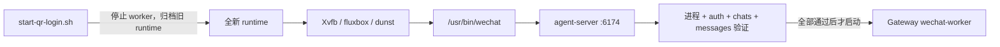

# CFserver 生产部署与运维

本文是 `CF_agent-wechat` 在 CFserver 上的生产部署权威说明。正式 Compose 为
`docker/compose.cfserver.yaml`，正式容器名为 `cf-agent-wechat`。

> [!IMPORTANT]
> 生产环境不再恢复旧微信登录会话。Debian 重启、容器重建或人工重新启动微信入口后，
> 必须 SSH 登录 CFserver，运行 `./scripts/start-qr-login.sh` 并用手机扫描全新二维码。

> [!CAUTION]
> 不得执行 `docker compose down`，也不得用 `docker compose up` 或 `restart` 代替
> 生命周期脚本。`docker/docker-compose.yml` 是实验配置，不是 CFserver 正式配置。

## 生产状态

- 正式 Compose：`docker/compose.cfserver.yaml`
- 正式容器：`cf-agent-wechat`
- 镜像：经批准的不可变 digest
- 容器显示：Xvfb `:99`，`1280x800x24`
- 窗口组件：fluxbox、dunst
- 应用：`/usr/bin/wechat`、agent-server `:6174`
- VNC：`ENABLE_VNC=0`
- 网络：外部 `cf-internal`
- 容器重启策略：`on-failure:3`
- 唯一启动入口：`./scripts/start-qr-login.sh`
- 停止入口：`./scripts/stop-qr-runtime.sh`

`on-failure:3` 仅允许当前人工启动流程中的有限失败重试。不得使用 `always` 或
`unless-stopped`，也不得在 Debian 重启后自动复用旧会话投入工作。

## 组件与放行门槛



Gateway 经 `cf-internal` 访问 `http://cf-agent-wechat:6174`。启动脚本只控制
`wechat-worker` 的停止和启动，不修改 Gateway 代码、配置数据库、PostgreSQL 或 Hermes
数据。Gateway 和 Hermes 上下文仍由各自数据库持久化。

因此，本仓库只能保证脚本取得控制后执行 stop/verify/start，不能保证 Debian 或 Docker
启动到人工执行脚本之前 worker 已停止。Gateway restart/boot stop gate 是 CFserver
实机验收前置条件，不得写成由本仓库代码保证。

## 生产目录

代码目录：

```text
/opt/cf-agent-wechat/
├── docker/
│   └── compose.cfserver.yaml
└── scripts/
    ├── start-qr-login.sh
    ├── stop-qr-runtime.sh
    ├── status.sh
    └── login.sh
```

Gateway 标准 Compose 输入：

```text
/opt/cf-agent-gateway/deploy/
├── compose.yaml
└── .env
```

其 Compose 项目目录为 `/opt/cf-agent-gateway/deploy`。标准布局下从
`/opt/cf-agent-wechat` 运行生命周期脚本无需导出 Gateway 路径变量。

存储目录：

```text
/srv/storage/cf-agent-wechat/
├── runtime/
│   ├── data/
│   └── wechat-home/
├── session-archive/
│   └── <UTC时间戳>/
│       ├── data/
│       ├── wechat-home/
│       └── manifest.json
└── secrets/
    └── auth-token
```

- `runtime/data` 挂载到 `/data`。
- `runtime/wechat-home` 挂载到 `/home/wechat`。
- `secrets/auth-token` 单独只读挂载到 `/data/auth-token`。
- `session-archive` 保存每次启动前的旧 runtime 和脱敏 manifest。

Token 不属于 runtime。移动 runtime 时不得移动、复制或读取 Token 内容。

首次上线 forced-QR 模式前可能仍有 legacy
`${STORAGE_ROOT}/data`、`${STORAGE_ROOT}/wechat-home`。只有 legacy 布局时，脚本把
存在的两个目录迁入同一个时间戳归档；新 runtime 与任一 legacy 目录并存时 fail-fast，
不修改任一布局。

## Compose 约束

`docker/compose.cfserver.yaml` 必须保留：

- 现有不可变镜像 digest 输入；
- `security_opt: seccomp=unconfined`；
- `SYS_PTRACE`；
- `ENABLE_VNC=0`；
- `cf-internal`；
- 6174 的现有受控绑定；
- 现有 healthcheck；
- JSON 日志大小和文件数限制；
- `restart: on-failure:3`。

不得新增公网端口。

运行目录挂载必须为：

```yaml
- ${CF_AGENT_WECHAT_RUNTIME_ROOT:-/srv/storage/cf-agent-wechat/runtime}/data:/data
- ${CF_AGENT_WECHAT_RUNTIME_ROOT:-/srv/storage/cf-agent-wechat/runtime}/wechat-home:/home/wechat
```

Token 继续使用独立只读挂载：

```yaml
- /srv/storage/cf-agent-wechat/secrets/auth-token:/data/auth-token:ro
```

`CF_AGENT_WECHAT_RUNTIME_ROOT` 只覆盖当前运行目录，不得指向 `secrets` 或
`session-archive`。为保证原子归档，覆盖路径必须满足启动脚本对同一受控文件系统的校验。

## 生产环境输入

| 变量 | 要求 |
| --- | --- |
| `AGENT_WECHAT_IMAGE` | 必填，使用批准的不可变 digest，禁止 `latest` |
| `AGENT_WECHAT_BIND_IP` | 保持现有受控绑定；真实值不进入公共文档 |
| `AGENT_WECHAT_PORT` | 保持现有 6174 映射 |
| `AGENT_WECHAT_CONTAINER_NAME` | 默认 `cf-agent-wechat` |
| `CF_AGENT_WECHAT_RUNTIME_ROOT` | 默认 `/srv/storage/cf-agent-wechat/runtime` |
| `CF_AGENT_WECHAT_ARCHIVE_ROOT` | 默认 `/srv/storage/cf-agent-wechat/session-archive`，必须与 runtime 位于同一文件系统 |
| `CF_AGENT_WECHAT_COMPOSE_FILE` | 默认使用本仓库 `docker/compose.cfserver.yaml` |
| `CF_AGENT_GATEWAY_COMPOSE_FILE` | 默认 `/opt/cf-agent-gateway/deploy/compose.yaml`；只用于控制 `wechat-worker` |
| `CF_AGENT_GATEWAY_ENV_FILE` | 默认 `/opt/cf-agent-gateway/deploy/.env`；只作为 Gateway Compose 的环境文件 |
| `CF_AGENT_GATEWAY_PROJECT_DIR` | 默认 `/opt/cf-agent-gateway/deploy`；Gateway Compose 项目目录 |
| `CF_AGENT_WECHAT_RUNTIME_UID` / `GID` | 仅在没有旧目录可继承时使用，默认 `1000:1000` |
| `CF_AGENT_WECHAT_RUNTIME_MODE` | 仅在没有旧目录可继承时使用，默认 `700` |
| `CF_AGENT_WECHAT_LOCK_FILE` | 默认 `/run/lock/cf-agent-wechat-qr-runtime.lock`；start/stop 共用 |
| `POST_LOGIN_READY_TIMEOUT` | 登录后 auth/chats/messages 有界等待，默认 `120` 秒 |
| `PROXY` | 可选；若含认证信息按敏感配置保护 |
| `RUST_LOG` | 默认 `info`；提高详细度前评估泄露风险 |

标准布局使用 `/opt/cf-agent-gateway/deploy/.env`，直接运行
`./scripts/start-qr-login.sh` 时无需 `export`。路径不同时保留
`CF_AGENT_GATEWAY_COMPOSE_FILE`、`CF_AGENT_GATEWAY_ENV_FILE` 和
`CF_AGENT_GATEWAY_PROJECT_DIR` 覆盖能力。生命周期脚本不自行解析、复制或输出
Gateway `.env` 内容；Docker Compose 通过 `--env-file` 将该文件作为插值/配置
输入使用。Token 禁止写入本仓库或 Gateway 的任何 `.env`；生产变量实值不得粘贴
到文档、工单或日志。

使用与实际部署相同的环境输入做静态校验：

```bash
cd /opt/cf-agent-wechat
sudo docker compose -f docker/compose.cfserver.yaml config --quiet
```

若使用受控 `--env-file`，静态校验和实际启动必须使用同一份输入。不要输出完整 Compose
渲染结果或完整环境。

## 首次部署前检查

1. 确认代码处于批准 Commit，镜像为批准 digest。
2. 使用实际环境输入运行 Compose `config --quiet`。
3. 确认 `cf-internal` 已存在。
4. 检查 runtime 与 legacy `data`/`wechat-home` 布局；mixed layout 必须先保留现场并
   明确受控来源，不能让脚本猜测或自动合并。
5. 确认 Token 为独立文件，secrets 和 Token 权限分别为 `root:root 700` 与
   `root:root 600`。
6. 确认旧 runtime 的 UID、GID 和权限可继承；首次运行没有旧目录时，确认
   `CF_AGENT_WECHAT_RUNTIME_UID/GID/MODE` 的默认 `1000:1000/700` 与镜像匹配，
   不匹配时必须显式覆盖后再运行。
7. 确认 Gateway 默认 Compose、环境文件和项目目录依次为
   `/opt/cf-agent-gateway/deploy/compose.yaml`、
   `/opt/cf-agent-gateway/deploy/.env` 和
   `/opt/cf-agent-gateway/deploy`，且只控制 `wechat-worker`；标准布局无需
   导出变量，路径不同时必须通过上述变量显式覆盖。
8. 在 CFserver 实机确认 Gateway restart policy/Compose/systemd boot stop gate，确保
   Debian 启动至人工运行脚本前 `wechat-worker` 持续停止；本仓库未修改 Gateway。
9. 确认 Python 3、curl、Docker Compose 及二维码依赖可用。
10. 先运行 `./scripts/start-qr-login.sh --dry-run`。

检查时只读取元数据，不读取 Token 或数据库内容。

## 唯一启动流程

```bash
cd /opt/cf-agent-wechat
./scripts/start-qr-login.sh
```

脚本必须按顺序：

1. 验证配置、目录和命令；非 dry-run 获取
   `/run/lock/cf-agent-wechat-qr-runtime.lock` 独占锁。
2. 停止 Gateway `wechat-worker`。
3. 停止并删除旧 `agent-wechat` 容器，不执行 Compose `down`。
4. 将当前 runtime 原子移动到新的 UTC 时间戳归档；首次上线只有 legacy
   `data`/`wechat-home` 时，将两者迁入同一个归档。mixed layout 在步骤 2 前失败。
5. 创建全新的 `runtime/data` 与 `runtime/wechat-home`，继承正确 UID、GID 和权限。
6. 启动容器并等待 agent-server 可访问。
7. 等待 `/usr/bin/wechat` 进程存在且稳定，并进入 `logged_out` 或二维码界面。
8. 调用 `login.sh --force-qr`，以 `newAccount=true` 请求二维码；SSH 终端必须实际
   渲染至少一个 QR，否则不接受登录成功。
9. 等待手机扫码和 `logged_in`。
10. 在 `POST_LOGIN_READY_TIMEOUT` 有界窗口内等待 WeChat 进程持续存在、auth 为
    `logged_in`、chats 至少返回一个聊天，并对 API 返回的一个聊天读取 messages。
11. 只有全部通过才启动 `wechat-worker`，随后输出最终状态。

worker 停止已经确认后，后续失败会保持停止、保留归档且不启动 AI 调度。若初始 stop
无法确认，脚本立即失败并报告“无法确认”；本仓库不能声称 worker 已停止。

### Dry run

```bash
./scripts/start-qr-login.sh --dry-run
```

Dry run 不修改目录、容器或 worker，并在获取锁前返回；它不得创建空 runtime、归档或
`/run/lock/cf-agent-wechat-qr-runtime.lock`。

### 并发与重复执行

start/stop 共用 `/run/lock/cf-agent-wechat-qr-runtime.lock` 的 `flock`。普通执行后空
锁文件可以保留，文件存在不代表锁正被持有。重复执行使用新的 UTC 时间戳目录，绝不
覆盖既有归档。

## 停止

```bash
cd /opt/cf-agent-wechat
./scripts/stop-qr-runtime.sh
```

停止脚本先停止 `wechat-worker`，再停止 `agent-wechat`。它不删除 runtime、Token 或
归档。`--dry-run` 只预览动作，并在获取锁前返回，不创建或遗留锁文件。

停止后的 runtime 不会在下次启动时恢复；下次启动先归档它，再要求新的二维码。

## 登录行为

`login.sh --force-qr` 必须使用 `newAccount=true`。若全新 runtime 仍返回
`logged_in`，脚本不得短路成功，而应返回：

```text
runtime is not clean; use start-qr-login.sh
```

登录工具不执行 UI logout，不删除用户数据。HTTP 响应或 WebSocket 事件必须在当前 SSH
终端实际渲染至少一个 QR；未渲染 QR 时拒绝接受 `login_success`。二维码不进入日志或
验证记录。

## 生产可用状态

`status.sh` 至少显示：

- `Container`
- `Agent Server`
- `WeChat Process`
- `Auth`
- `QR Runtime Mode`
- `Message API`
- `Gateway WeChat Worker`

WeChat 进程不存在或 `/api/chats` 不可读时必须非零退出。只有进程存在、auth 为
`logged_in` 且 chats 可读时，状态才为生产可用。账号和聊天 ID 不得输出。

容器 `healthy`、WebSocket `login_success` 或 auth `logged_in` 任一单项都不足以证明
生产可用。worker 放行还要求 chats 非空和 messages 读取成功。

## 归档 Manifest

每个 `session-archive/<UTC时间戳>/` 至少保存：

- 原 `runtime/data`；
- 原 `runtime/wechat-home`；
- 流程启动与结束 UTC 时间；
- 原 runtime、data、wechat-home 的 UID、GID 和 mode；
- 流程结果类别和执行阶段。

legacy `data` 与 `wechat-home` 必须进入同一个时间戳归档。manifest 的
`sourceLayout` 和 `sourcePaths` 记录其非敏感来源；mixed 新旧布局不会产生迁移归档，
而是在任何状态变更前失败。

manifest 禁止包含 Token 或指纹、微信账号、联系人、聊天 ID、消息正文、二维码、服务器
凭据或数据库内容。

### 保留策略

启动和停止脚本都不删除历史归档。运维平台应监控容量，并由数据所有者、安全负责人和
审计要求共同确定保存期限。任何到期处置必须通过本项目之外的独立审批流程执行；本说明
不授权自动清理。

## Debian 重启、重建和回滚

三种场景使用同一规则：

```text
SSH -> start-qr-login.sh -> 手机扫码 -> 自动验证 -> worker 启动
```

- Debian 重启后不等待容器自动恢复旧会话。
- 容器重建后不挂载旧会话继续工作。
- 镜像或代码回滚后仍创建全新 runtime。
- 旧运行目录只归档，不恢复为活跃登录态。
- Token 保持独立只读挂载。
- 完整验证前 worker 保持停止。

最后一项仅描述启动脚本确认 stop 之后的阶段。本仓库未修改 Gateway，不能保证 Debian
启动至脚本执行前 worker 已停止；该 boot stop gate 必须在 CFserver 实机重启验证。

重启期间发送给机器人的消息可能不会被本地微信补拉。必须等 worker 启动后再发送业务
消息。

## 安全边界

- 不执行 Compose `down`。
- 不修改 PostgreSQL、Gateway 或 Hermes 数据库。
- 不修改 `CF_agent-gateway` 或其他仓库。
- 不新增公网端口。
- 不输出 Token、二维码、微信账号、联系人、聊天 ID、聊天正文、API Key 或密码。
- VNC、noVNC、x11vnc、websockify、宿主 X11、XFCE 和 RDP 均不属于生产流程。

## 实机验证边界

2026-08-13 的已信任设备登录和 2026-08-14 的消息接口证据属于旧生产基线。它们不能
替代本次强制全新二维码流程的 CFserver 现场验证。

本变更合入后仍需在 CFserver 完成一次真实手机扫码，并验证 legacy 首次迁移、mixed
layout fail-fast、终端实际 QR、锁、API 有界等待、WeChat 进程稳定和脚本内 worker
放行。还必须单独验证 Debian 启动到脚本执行前的 Gateway boot stop gate；本仓库不能
代替该现场证据。验证记录必须脱敏。
当前状态见 [验证总览](../validation.md)。
